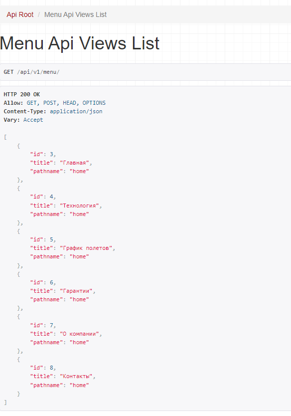
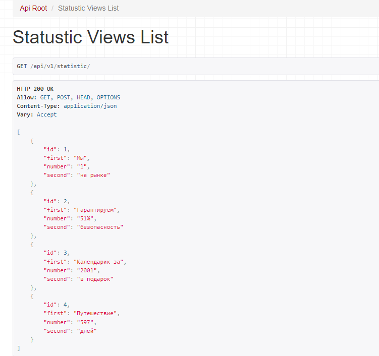
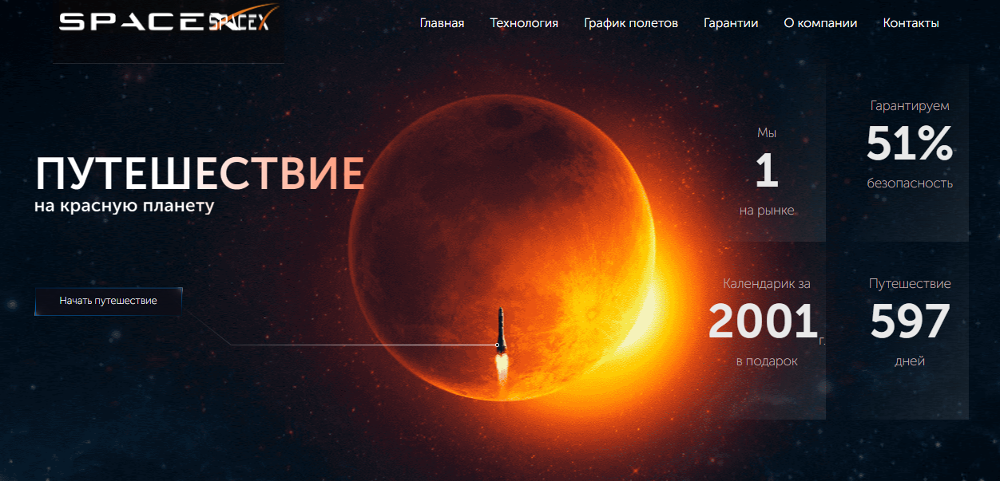
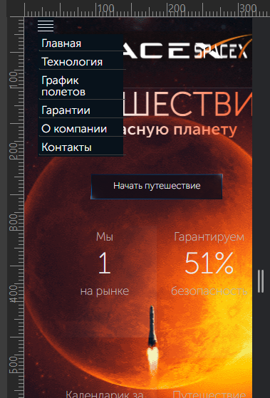

# Задачи
Дизайнеры компании предоставили Вам макет первого экрана главной страницы в формате psd. \
https://yadi.sk/i/m5qDjh0Vf5vSug (формат psd выбран специально).


## Вам нужно сделать:
1. Сверстать первый экран главной страницы
2. Реализовать Front на Vue.js/React.js
3. Реализовать Back на Python Django (возможно реализовать на bitrix или wordpress, в таком случае Front на HTML/CSS. Больший приоритет будет отдаваться соискателям со стеком Vue.js/React.js Python Django)
4. Сделать адаптивную верстку для планшета и телефона. (Да, в PSD нет этих версий, Вы должны сами расставить элементы интерфейса так, чтобы все выглядело гармонично).
5. Через админ панель должна быть возможность редактировать контент блоков преимуществ и управлять пунктами меню.
5. Готовое задание загрузить с помощью формы по ссылке https://b24-iu5stq.bitrix24.site/send-test/?b24form_user=2.7745-1721114584-41d35a401080d30071137b175665b6a564bb98127d440271a8015d2973881024
(вам необходимо выгрузить результат на любой хостинг и отправить ссылку на развернутое на хостинге тестовое)

## О работе
 - Проект имеет отдельно загруженные шрифты (`spacex/frontend/src/fonts`)
 - Stack: TS, React, Django, DRF, Webpack 
 - в корне проекта необходимо создать файл `.env` и разместить `DJ_SECRET_KEY: < ключ от вашей CMS Django>`

API меню \
 

Статичтика \


Desctop страница \


Mobill страница \


### Чтоб развернуть проект комманд
 - `cd spacex/frontend`
 - `npm install package.json` или`yarn add package.json`
 - `yarn build` или `npm run build` сборка проекта.
 - `yarn server:front` или `npm run server:front` запускаем сервер для работы с фронтом.
 - `yarn watchs` или `npm run watchs` отслеживаем изменения файлов и перезапускаем сервер.
 -  `py manage.py makemigrations` & `py manage.py migrate` создаем базу данные.
 -  `py manage.py runserver` запускаем django.


Note: Если потребуется API `http://127.0.0.1:8000/api/v1/statistic/` 

#### Корректируем настройки для работы на фронт
##### Webpack
```js
    // сейчас
    output: {
        path: path.resolve(__dirname, '../static/spacex/javascripts'), 
        filename: 'main-[id]-[hash].js', // filename: 'main-[id]-[hash].js',
    
        clean: true,
    },

    // сделать
    output: {
        path: path.resolve(__dirname, 'dist'),
        filename: 'main-[id]-[hash].js', // filename: 'main-[id]-[hash].js',
    
        clean: true,
  },
```

```js
    // сейчас
    {
        test: /\.(png|svg|jpg|jpeg|gif)$/i,
        type: 'asset/resource',
        generator: {
          filename: '../pic/[name][ext]',
        },
    },
    {
        test: /\.(woff|woff2|eot|ttf|otf)$/i,
        type: 'asset/resource',
        generator: {
          filename: '../fonts/[name][ext]'  // [hash][ext][query]'
        }
    },
    
    // сделать
    {
        test: /\.(png|svg|jpg|jpeg|gif)$/i,
        type: 'asset/resource',
        generator: {
          filename: 'pic/[name][ext]',
        },
    },
    {
        test: /\.(woff|woff2|eot|ttf|otf)$/i,
        type: 'asset/resource',
        generator: {
          filename: 'fonts/[name][ext]'  // [hash][ext][query]'
        }
    },
    
```

```js
    // сейчас
    new MiniCssExtractPlugin({
        filename: '../css/style.css'
    }),
    
    // сделать
    new MiniCssExtractPlugin({
        filename: 'css/style.css'
    }),
```
## Файл .ENV
```text
DJ_SECRET_KEY: < django-ключ >
POSTGRES_DB: < имя db >
POSTGRES_USER: < имя пользователя от db >
POSTGRES_PASSWORD: < пароль от db >
POSTGRES_HOST: < хост от db >
POSTGRES_POST: < порт от db >
NGINX_EXTERNAL_PORT: < порт от nginx >
DOCKER_LOGIN= < логин от Docker-аккаунта >
DOCKER_PASSWORD= < пароль от Docker-аккаунта >
VERSION=2
```
## my_password.txt
```text
root
|docker
| |nginx
| | |nginx.conf
| | |nginx.Dockerfile
| | |proxi_params

```
